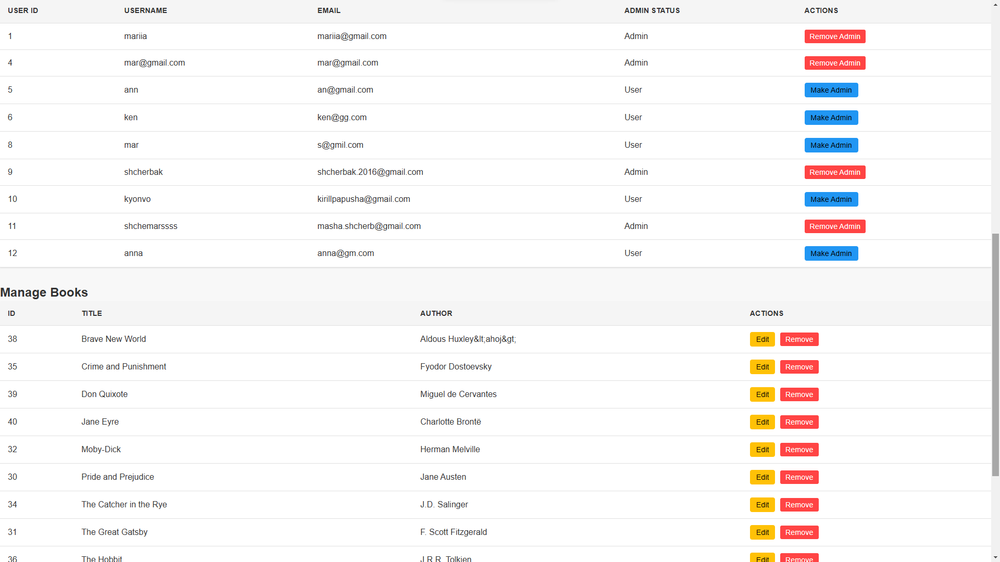

# BookReviews

BookReviews je webová aplikace, která umožňuje uživatelům prohlížet knihy, číst a psát recenze a sdílet své názory s ostatními čtenáři.

## Obsah

1. [Registrace](#registrace)
2. [Přihlášení](#přihlášení)
3. [Prohlížení knih](#prohlížení-knih)
4. [Psaní recenzí](#psaní-recenzí)
5. [Uživatelský profil](#uživatelský-profil)
6. [Administrátorské funkce](#administrátorské-funkce)

## Registrace 

Pro registraci postupujte následovně:

1. Klikněte na tlačítko "Registrovat" v horní části stránky.
2. Vyplňte následující pole:

 **Uživatelské jméno:**

1. Musí být jedinečné
2. Délka: 3-25 znaků
3. Povolené znaky: písmena, čísla, podtržítka

 **E-mail:**

1. Musí být platná e-mailová adresa
2. Musí být jedinečný (nemůže být použit pro více účtů)

 **Heslo:**

1. Délka: minimálně 8 znaků
2. Musí obsahovat alespoň jedno velké písmeno, jedno malé písmeno a jedno číslo

 **Potvrzení hesla:**

1. Musí být shodné s heslem zadaným výše

 Nahrajte profilovou fotografii:

1. Povolené formáty: JPG, JPEG, PNG, GIF
2. Maximální velikost: 2 MB

 Klikněte na tlačítko "Registrovat".

 

## Přihlášení

Pro přihlášení:

 Klikněte na tlačítko "Login" v horní části stránky.
 Zadejte:

1. E-mail: Váš registrovaný e-mail
2. Heslo: Vaše heslo

 Klikněte na tlačítko "Přihlásit se".

 

## Prohlížení knih

Na hlavní stránce najdete seznam knih. Můžete:

- Procházet knihy pomocí stránkování ve spodní části seznamu.
- Kliknout na knihu pro zobrazení podrobností a recenzí.

Detaily knihy obsahují:

- Název knihy
- Autor
- Popis knihy
- Počet stranek
- Nakladatelství
- Rok vydání
- Země
- Průměrné hodnocení
- Seznam recenzí

 

## Psaní recenzí

Pro napsání recenze:

1. Přihlaste se do svého účtu.
2. Otevřete stránku s detaily knihy.
3. Posuňte se dolů k sekci "Napsat recenzi".
4. Vyplňte formulář pro recenzi:

 **Hodnocení:** Vyberte 1-5 hvězdiček
 **Text recenze:**

1. Maximální délka: 10000 znaků

  Klikněte na tlačítko "Odeslat recenzi".

 

## Uživatelský profil

Pro přístup k profilu klikněte na své uživatelské jméno v horní části stránky.
Ve svém profilu můžete:

 Zobrazit své osobní údaje:

1. Uživatelské jméno
2. E-mail
3. Foto

 Změnit heslo:

1. Zadejte současné heslo
2. Zadejte nové heslo (stejná pravidla jako při registraci)
3. Potvrďte nové heslo

 Zobrazit seznam vašich recenzí:

1. Odkaz na knihu
2. Vaše hodnocení

 Odstranit své recenze:

1. Klikněte na tlačítko "Delete" u příslušné recenze
2. Potvrďte smazání

 

## Administrátorské funkce  

Pro přístup k administrátorskému panelu klikněte na "Admin Panel" v horní části stránky.
Pokud jste administrátor, máte přístup k dalším funkcím:

### Přidávání nových knih:

 Vyplňte všechny povinné údaje o knize.
 Nahrajte obrázek obálky knihy.

- **Název knihy** (povinné, min 3, max. 50 znaků)
- **Autor** (povinné, min 3, max. 50 znaků)
- **Rok vydání** (povinné)
- **Počet stran** (povinné, celé číslo)
- **Popis** (povinné, min 10 znaků, max. 2000 znaků)
- **Země vydání** (povinné, min 3, max. 30 znaků)
- **Nakladatelství** (povinné, min 3, max. 50 znaků)
- **Obrázek obálky:**

- Povolené formáty: JPG, PNG, JPEG, GIF
- Maximální velikost: 2 MB

 Klikněte na "Přidat knihu".

 

### Správa uživatelů:

- Zobrazit seznam všech uživatelů
- Přidělit/odebrat administrátorská práva

 

### Mazání knih:

- Klikněte na tlačítko "Smazat" u příslušné knihy v seznamu

 ### Úprava existujících knih:

- Můžete upravit všechny výše uvedené údaje
- Při úpravě obrázku obálky platí stejná pravidla jako při přidávání

 

